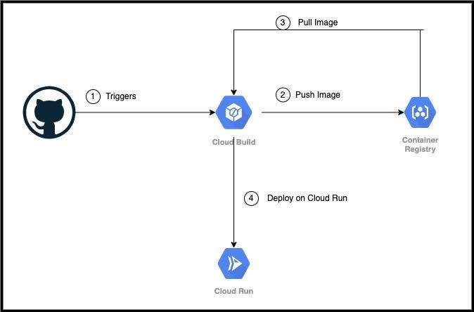

# Infrastructure

The infrastructure was provisioned using terraform. Basically we deploy our backend to the google cloud. This project has a client-server architecture and in the server-side we did not decouple the logic so it is bascially a monolithic application. The infrastructure provisioning involves the use of terraform to create an artifact repository and then deploy the application to that artifact repository following which we build the application using cloud build and the traffic is routed to the project via cloud run.

